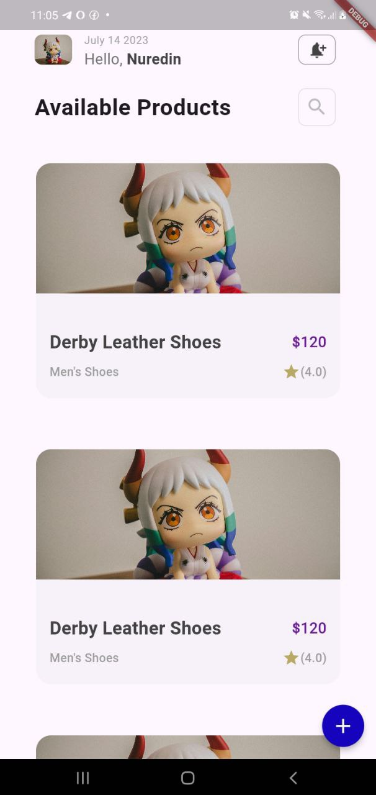
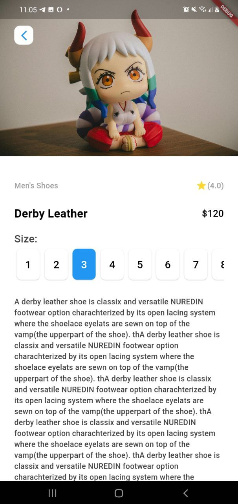
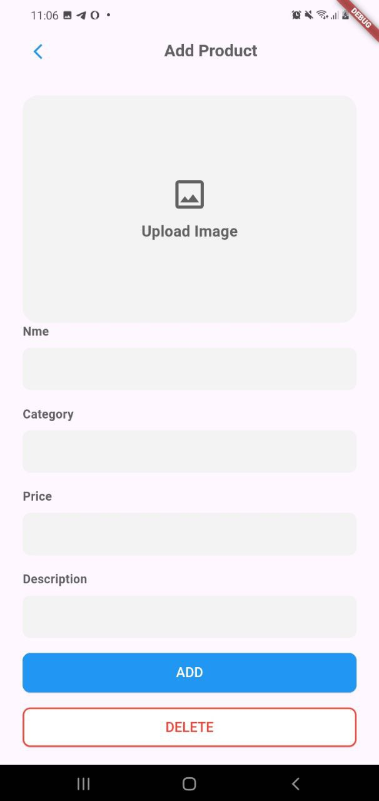
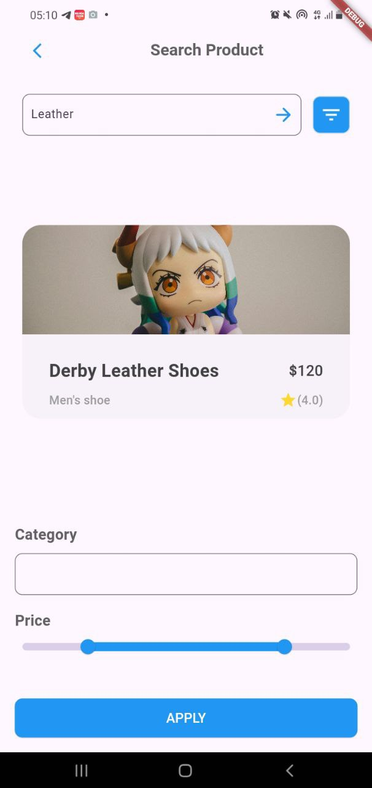

## Screenshots

Below are some screenshots of the project:

### add_screen



### detail_screen



### home_screen



### search_screen




Here’s a well-structured `README.md` file for your eCommerce app using Flutter:

---

# Mobile Task Six

Welcome to the **Mobile Task Six** repository! This project is an eCommerce app built with Flutter. Follow the steps below to clone, set up, and run the app on your local machine.

## Table of Contents

- [Project Overview](#project-overview)
- [Installation](#installation)
- [Running the App](#running-the-app)
- [Troubleshooting](#troubleshooting)
- [Contributing](#contributing)
- [License](#license)

## Project Overview

**Mobile Task Six** is a Flutter-based eCommerce application that provides users with a seamless shopping experience. The app features product browsing, search functionality, and a user-friendly interface designed for both Android and iOS platforms.

## Installation

Follow these steps to clone the repository and set up the app on your local machine.

### Step 1: Clone the Repository

Clone the repository using Git:

```bash
git clone https://github.com/nuredinbedruyimer/mobile_task_six.git
```

### Step 2: Navigate to Project Directory

Change to the project directory:

```bash
cd mobile_task_six
```

### Step 3: Install Dependencies

Install the project dependencies using Flutter:

```bash
flutter pub get
```

### Step 4: Check Flutter Environment

Ensure that your Flutter environment is properly set up and there are no issues:

```bash
flutter doctor
```

### Step 5: Run the App

Run the app on your local device or emulator:

```bash
flutter run
```

## Troubleshooting

If you encounter any issues, consider the following steps:

- **Check Flutter Installation**: Run `flutter doctor` to diagnose any setup issues.
- **Update Dependencies**: Ensure all dependencies are up to date by running `flutter pub get` again.
- **Clean Build**: Use `flutter clean` to remove any build artifacts and then rebuild the app.

## Contributing

We welcome contributions to this project! If you have suggestions or improvements, please follow these guidelines:

1. Fork the repository.
2. Create a new branch (`git checkout -b feature/your-feature`).
3. Commit your changes (`git commit -am 'Add some feature'`).
4. Push to the branch (`git push origin feature/your-feature`).
5. Create a new Pull Request.


